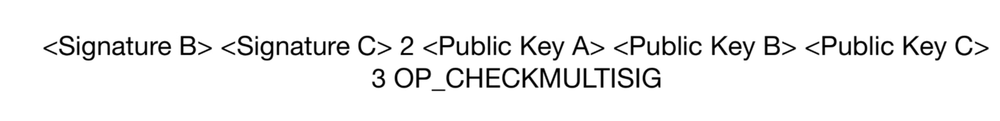

# Types of Wallets:
- Just a Bunch Of Keys Wallet (JBOK Wallet) > Non-deterministic Wallet
- Hierachical Deterministic Wallet (HD Wallet) -> deterministic Wallet
# Full Blockchain Node vs Wallet Node vs Miner Node vs Network Routing Node

# What are SVP Nodes

# What is Regtest Node and Testnet Network

# What is RPC server in Bitcoin

# What is ZeroMQ in Bitcoin

# Bitcoin Core Binaries Files
- `bitcoin-cli`
- `bitcoin-qt`
- `bitcoin-tx`
- `bitcoin-util`
- `bitcoin-wallet`
- `bitcoind`
- `test_bitcoin`

# Testnet vs Mainnet
It's not a good idea to use Mainnet while learning about bitcoin core for three reasons to avoid:
- Transaction fees
- Blocktime (added to blockchain every 10 minutes)
- Save to play around


# What is Regtsest
For situations where interaction with random peers and blocks is unnecessary or unwanted, Bitcoin Core’s regression test mode (regtest mode) lets you instantly create a brand-new `private block chain` with the same basic rules as testnet—but one major difference: you choose when to create new blocks, so you have complete control over the environment.

# What are the applications (layer2) for bitcoin scripting
- Atomic Swap
- Lightning Network
- Ligtning Loop
- Multisig
# What is Atomic Swap
An atomic swap is an `exchange of cryptocurrencies from separate blockchains`. The swap is conducted between two entities without a third party's involvement. The idea is to remove centralized intermediaries like regulated exchanges and give token owners total control.

It uses at the core, `Hashed Time Locked Contract Transaction`:
- Time Locked
- Special Key
# What is Lightning Network and Ligtning Loop
Wikipedia said: "The Lightning Network (LN) is a "layer 2" payment protocol layered on top of Bitcoin (and other blockchains and cryptocurrencies). It is intended to enable fast transactions among participating nodes and has been proposed as a solution to the bitcoin scalability problem. It features a peer-to-peer system for making micropayments of cryptocurrency through a network of bidirectional payment channels without delegating custody of funds".

It's based as well on `Hashed Time Locked Contract Transaction` concept

# What is Multisig

# What is Raw Transaction Serialization
All nodes need to agree on how we serialize

# Transaction Fees
Transaction fees serve as an `incentive` to include (mine) a transaction into the next block and also as a `disincentive` against abuse of the system by imposing a small cost on every transaction. Transaction fees are collected by the miner who mines the block that records the transaction on the blockchain.

Transaction fees are calculated based on `the size of the transaction in kilobytes`, not the value of the transaction in bitcoin. Overall, transaction fees are set based on market forces within the bitcoin network. Miners prioritize transactions based on many different criteria, including fees, and might even process transactions for free under certain circumstances. Transaction fees affect the `processing priority`, meaning that a transaction with sufficient fees is likely to be included in the next block mined, whereas a transaction with insufficient or no fees might be delayed, processed on a best-effort basis after a few blocks, or not processed at all. Transaction fees are not mandatory, and transactions without fees might be processed eventually; however, including transaction fees encourages priority processing.

# Locking and Unlocking Script
Locking script is a spending condition based on `the transaction output` Histroically the locking script was called a `scriptPubKey` because it usally contained a public key or bitcoin address (public key hash) also it is refeered to as a `witness script` or `cryptographic puzzle` these all terms mean the same thing, at different levels of abstractions.

The Unlocking script that `solves` or `satisfies` the conditions based on the UTXO ouput by a locking script allows the output to be spent. Unlocking scripts are part of every `transaction input` Most of the time they contain `digital signature` produced by the user's wallet from his or her private key. Historically it was called `scriptSig` because it usually contained a digital signature also it refeered to `witness`.


Combining scriptSig and scriptPubKey to evaluate a transaction script

```
Script Construction = Locking Script + Unlocking Script
```

Separate execution of unlocking and locking scripts to avoid the vulnerability that allowed a malformed unlocking script to push data onto the stack and corrupt the locking script.

# Bitcoin Transaction Scripts
Why we need to many differnt Bitcoin Transaction Scripts? the short answer is that we have many use cases that each one fit into (for more information look at the Script Types Usage resource down below)


# MultiSignature Script
Requires `M` out of `N` Keys to sign


# Additional Resources
[Bitcoin Developer Documentation](https://developer.bitcoin.org/)
[Lightning Network Official Website](https://lightning.network/)
[Bitcoin IDE](https://siminchen.github.io/bitcoinIDE/build/editor.html)
[Bitcoin OP Codes](https://en.bitcoin.it/wiki/Script#Opcodes)
[Big endian and little endian](https://www.techtarget.com/searchnetworking/definition/big-endian-and-little-endian)
[Bitcoin Transaction Fees Estimator](https://bitcoinfees.earn.com/)
[Pay-to-Pubkey Hash](https://en.bitcoinwiki.org/wiki/Pay-to-Pubkey_Hash)
[Turing Incompleteness Bitcoin Script Language](https://river.com/learn/terms/t/turing-completeness)
[Script Types Usage](https://river.com/learn/terms/s/script-bitcoin/)