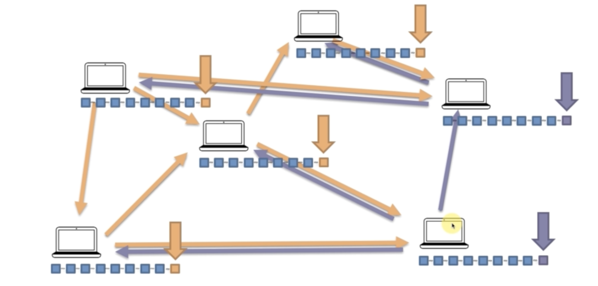

## Byzantine Fault Tolerance
To oversimplify this concept it basically a consensus which deside each general(node) command(transaction) to listen to:
- Up to f generals might behave malicously
- Honest generals don't know who the malicious ones are
- The malicious genreals may collude
- Nervertheless, hones generals must agree on plan
- Theorem: need 3f + 1 generals in total to tolerate f
  malicious generals (i.e: < 1/3 may be malicious) so for example if you have 3 generals and one of them is malicious you don't tolerate the fault but you should have at least 4 generals to tolerate that malicious one
<h1 align="center">
   
</h1>

## When we nee Consensus Protocol
Let's say you're a miner and you mined a block and you finally you get the reward of solving the cryptographic puzzle which is very hard to solve in that could it's called gold nounce in the context of bitcoin it is 12 and half bitcon for mining a single block.

What if you added a malicious block in the chain? so there is a need to come to an aggrement before adding each block in the chain to make sure the integrity of the blockchain. It's a good idea to search the verification steps of your preferred blockchain.

Notice: Solving the cryptographic buzzle is very hard to solve to come with a hash that meet below the target but verifying the block is easy to solve because it's just checking and computing the content of the block match the hash of that block you could refer to the hashing concepts in this repo we explained it further!

## Types of Consensus Protocols:
- Proof of Work (PoW)
- Proof of State (PoS)
- Others

## Proof of Work (PoW) Consensus Protocol
You know that that concept of Peer-to-Peer network which is distributed across the world to make blockchain technology work. It's all over the internet which definitely there is some delay. For example you added a block to the chain on one orange node and it took like 2 seconds to propogate to other nodes at the same time one added a block to the other side and it took like 2 seconds to propogate so it does like a network segmentation one side has orange nodes and th other has purple nodes which leads to `competing chains` so there is must be a consensus similar to the concept of `Byzantine Fault Tolerance` Unlike Byzantine concept which you should have at more than 70% non-malicious to come an aggrement in PoW you should have more than 50% of the hashing power come to concensus. The purple blocks are then left off and named `orphan blocks`

Note: The more nodes in competing chain in our case e.g:(orange nodes) the more hashing power is so the more hashing power of the chain The longest chain is and remember the longest chain is always the winner when it comes to PoW consensus protocol agreement

<h1 align="center">
   
</h1>

## Additional Resources
[Play around with Peer-to-Peer Distributed Network in Bitcoin](https://tools.superdatascience.com/blockchain/distributed) This is a demo where you can re-enforce your learning concepts of blockchain like P2P network, Consensus protocols, and more!
[Byzantine Fault Tolerance](https://medium.com/loom-network/understanding-blockchain-fundamentals-part-1-byzantine-fault-tolerance-245f46fe8419) This article explains the concept of Byzantine Fault Tolerance pretty well
[A Peer-to-Peer Electronic Cash System](https://www.bitcoin.com/bitcoin.pdf) Satoshi Nakamoto (an alias for the person who invented the Bitcoin) discusses the Proof of Work Consensus Protocol type and more it's a good idea to check it out.
[Short guide blockchain consensus protocols](http://www.coindesk.com/short-guide-blockchain-consensus-protocol)