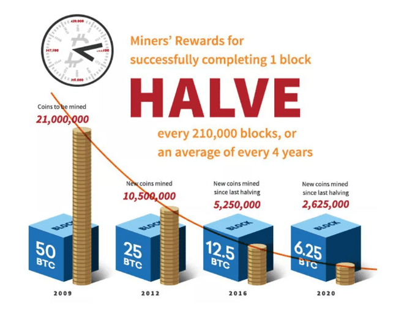

# Cryptocurrency

## Bitcoin's Monetary Policy
- **Halving**
Every 210,000 blocks or every 4 years, the nunber of Bitcoins per block is reduces by two.

- **Block Frequency**

# What are Unspent Transaction Outputs (UTXOs)
A UTXO is the amount of digital currency remaining after a cryptocurrency transaction is executed. UTXOs are processed continuously and are part of the beginning and end of each transaction. There is no sense of accounts in the context of cryptocurrencies all you have is UTXOs inputs and outputs.
# Where do transaction fees come from
Anything you don't account for in the output UTXOs become the fees of the transaction even though blockchain `theoratically` can be
free but there is a competition about mining blocks and confirming transations you need to put a fee. The higher the fee is the more
sooner it's get accepted
# How wallets work ?
There isn't actually a balance value in the Blockchain just list of UTXOs. The Wallets actually calculate the UTXOs sent to you and calculate the balance
# Signatures: Private & Public Keys
- There are two proceses:
    - Signing Process: (Message + Digital Signature[Hashed Message + Encryption using Private Key])
    - Verification Process: (Message + Digital Signature + Public Key)
- Public Key is generated from Private Key using `Elliptic Curve Multiplication`
- Bitcoin Address is generated from Public key using `Double Hash (SHA256 + RIPEMD160)` and then `Base58Check Encode` on the public key hash output
- Private key is a decimal number but public key is a hexadecmial one

By this we're mainting security and integrity of the blockchain

# What is Segregated Witness ? (SegWit)

# Public Key vs Bitcoin Address

# Hierachically Deterministic (HD) Wallets

## Additional Resources
[Cryptocurrencies Market Capitalization](https://coinmarketcap.com/)
[Traditional Monetary Policy Explained](https://www.youtube.com/watch?v=gUGxGCW-k7o&t=2s)
[What Happens to Bitcoin After All 21 Million Are Mined?](https://www.investopedia.com/tech/what-happens-bitcoin-after-21-million-mined/)
[Bitcoin Monetary Inflation over time](https://chart-studio.plotly.com/~BashCo/5.embed?share_key=liQvkaTiHXjX2W41UiqzCn)
[Signatures & Keys Demo](https://tools.superdatascience.com/blockchain/public-private-keys/keys)