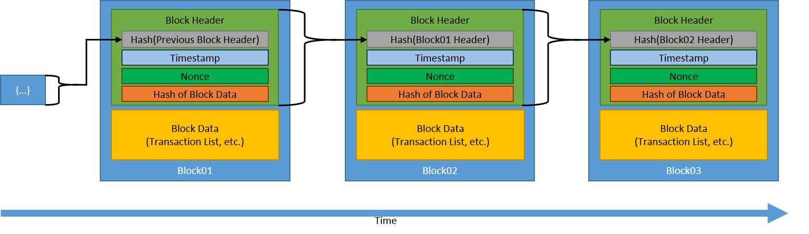

<h1 align="center">
  <br/>
</h1>

## Hashing in Bitcoin
Hashing is a fundamental concept in the functioning of the Bitcoin blockchain. It is a mathematical function that takes an input (or "message") and returns a fixed-size output, known as a "hash". The hash is unique to the input, so even the smallest change in the input will result in a completely different hash.

In Bitcoin, hashing is used to secure transactions and to create new blocks. Each block in the Bitcoin blockchain contains a list of transactions, a reference to the previous block's hash, and a nonce, which is a random number that is generated and used to try and find a hash that meets certain criteria.

There are certain criteria for Hashing Algorithms it's a good idea to understand them very well who knows you may invent your hashing algorithm :) :
- One way (non-reversable) that means If I have crated the hash for the input data I couldn't reverse engineering back
- Deterministic that mean every time I entered the same data it gives me the same output hash
- Fast Computation
- The Avalanche Effect that means any small change with the data makes avalanche effect or huge effect in the output hash
- Must withstand with (artifical/natural) collisions that means in the case of SHA256 algorithm we have 2^256 possibilities of hashed documents and you know it is finite (like the fingerprint of the human the possibility of having the same fingerprint is 1 in 60,000,000) so it needs to handle this collision very welll with help of the `piegon hole principle` which means if you have 10 piegons and 9 holes there's no way around unless you put two in one hole


## shasum_hashing script
The script `shasum_hashing.sh` is a simple implementation of a hash function in bash, using the `sha256sum` utility. It provides a basic example of how hashing can be used to verify the integrity of data.


To run the script, simply pass in a file as an argument and if you would like a shasum hash type (e.g: 1, 224, 256), and it will output the given hash type (e.g: sha256) hash of the file's contents:

```bash
chmod +x shasum_hasing.sh
./shasum_hashing.sh data/big.txt 256
````

Types of shasum hashes:
```
1 (default), 224, 256, 384, 512, 512224, 512256
````
## Additional Resources
[Blockchain Hashing Tools](https://tools.superdatascience.com/blockchain/hash) This website provides a visual 
representation of how hashing works in the context of blockchain.

[Cryptography and Network Security](https://webspace.science.uu.nl/~tel00101/liter/Books/CrypCont.pdf) Principles and 
Practice: This book provides an in-depth treatment of cryptography and network security, including a section on hash functions.

[Blockchain and Immutable Ledgers](https://medium.com/cryptoeconomics-australia/the-blockchain-economy-a-beginners-guide-to-institutional-cryptoeconomics-64bf2f2beec4) This article explain the importance of blockchain on the econonmy not from the money but from Ledger prospective (e.g: Property ledger).

[The Meaning of Decentralization](https://medium.com/@VitalikButerin/the-meaning-of-decentralization-a0c92b76a274) Explain 
the differences between Distributed and Decentralized Systems in addition to the three types of Decentralization 
Architectural, Political, and Logical Decentralization.
